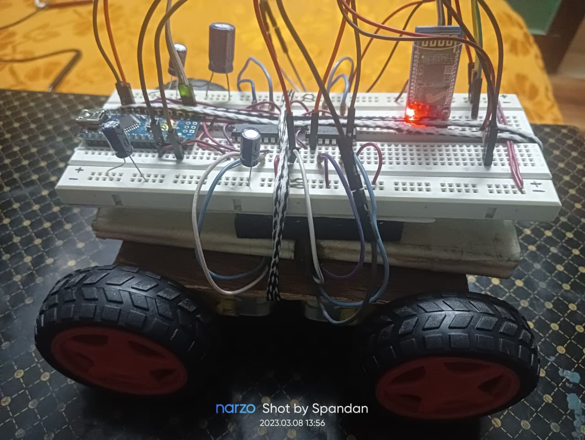
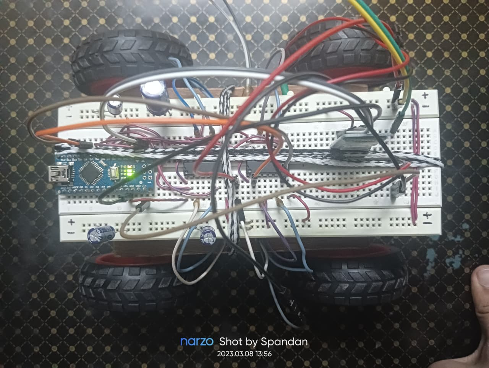
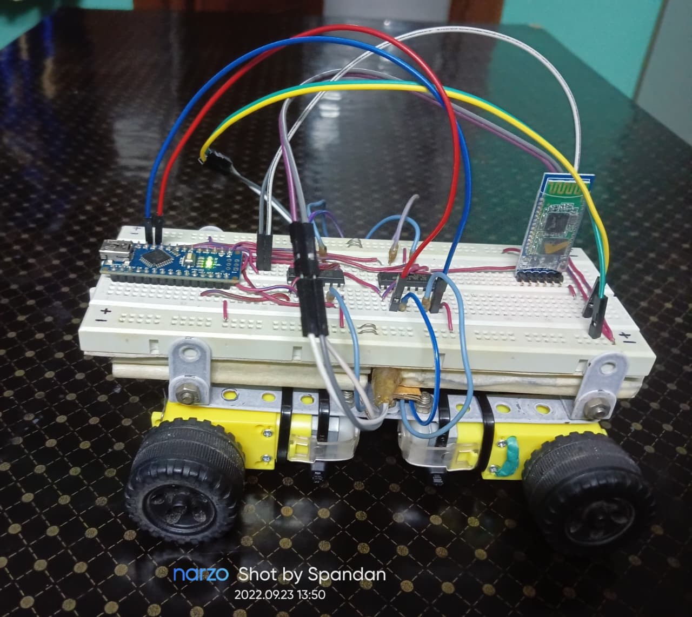

# 🚗 Bluetooth Controlled RC Car using Arduino Nano & HC-05

A DIY **Bluetooth-controlled robotic car** built using **Arduino Nano**, **HC-05 Bluetooth module**, and **L293D motor driver ICs**.  
The car can be wirelessly controlled from an **Android smartphone** using simple directional commands sent over Bluetooth.

This project demonstrates **embedded systems design**, **motor control**, and **wireless serial communication**, making it ideal for beginners and intermediate robotics enthusiasts.

---

## 📌 Features

- 📱 Wireless control via Bluetooth (HC-05)
- 🔁 Forward, backward, left, right, and stop movements
- ⚙️ Dual L293D motor drivers for 4 DC motors
- 🔋 Separate power supply for motors and logic
- 🧠 Compact and efficient Arduino Nano based design
- 🔧 Breadboard-friendly and easy to modify

---

## 🧰 Components Used

- Arduino Nano  
- HC-05 Bluetooth Module  
- L293D Motor Driver IC ×2  
- DC Gear Motors ×4  
- 9V Battery ×2  
- Breadboard  
- Jumper Wires  
- Android Phone (Bluetooth Controller App)

---

## 🔌 Circuit Diagram


**Key Connections:**
- HC-05 TX → Arduino RX  
- HC-05 RX → Arduino TX (via voltage divider recommended)  
- L293D inputs → Arduino digital pins (defined in the code section)
- Motor supply → External 9V battery  
- Common GND shared between all components  

---

## 💻 Arduino Code

- Written in **Embedded C**
- Uses **Serial communication** for Bluetooth data
- Below is a brief snippet showing how the motor driver and Bluetooth pins are defined in the Arduino code:

```cpp
// Motor Driver 1
#define frontRight1 2
#define frontRight2 3
#define frontLeft1 4
#define frontLeft2 5

// Motor Driver 2
#define backRight1 6
#define backRight2 7
#define backLeft1 8
#define backLeft2 9

// Bluetooth Module (HC-05)
#define BT_RX 1   // Arduino receives data
#define BT_TX 0   // Arduino transmits data
```

- Character-based command system:
  - `F` → Forward  
  - `B` → Backward  
  - `L` → Left  
  - `R` → Right  
  - `S` → Stop  

The complete source code is available here:  
📂 `code/Bluetooth_car.ino`

---

## 📱 Mobile App

You can use any Bluetooth controller app, such as:
- **Bluetooth RC Controller**
- **Arduino Bluetooth Controller**
- **Serial Bluetooth Terminal**

Pair with HC-05 using default PIN: 0000 or 1234

---

## 🚀 How to Use

1. Upload the `Bluetooth_car.ino` file to Arduino Nano  
2. Power the circuit  
3. Pair your phone with HC-05  
4. Open the Bluetooth controller app  
5. Send movement commands  
6. Enjoy driving your RC car 🚗💨

---

## 📸 Project Images

#### Car Side View


#### Car Top View


#### Car with different frame design


---

## 🎥 Project Demo Video
🔗 **Click here to watch the Bluetooth RC Car demo:**  
[Google Drive – Project Demo Video](https://drive.google.com/file/d/19VugccY8szb6zCZUG1RpigRMaMEaHonB/view?usp=sharing)

---

## 🧠 Learning Outcomes

- Bluetooth serial communication  
- Motor driver interfacing  
- Power management for embedded systems  
- Real-time control using microcontrollers  
- Debugging hardware + firmware together  

---

## 🔮 Future Improvements

- Speed control using PWM  
- Obstacle avoidance using ultrasonic sensor  
- Custom Android app using MIT App Inventor  
- Rechargeable Li-ion battery pack  
- PCB design for compact layout  

---

## 📜 License

This project is licensed under the **MIT License** — feel free to use, modify, and distribute.

---

## 🙌 Author

**Spandan Choudhury**  
Embedded Systems | Robotics | IoT  
GitHub: `@BeamCruzer`


